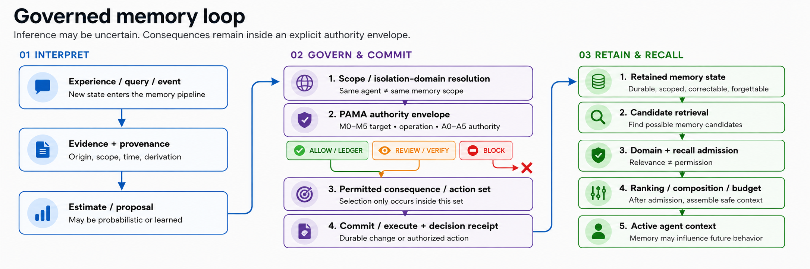

<p align="center">
  
</p>

<div align="center">

# 01010001 Agent Memory

<p><sub><strong>Q Agent Memory</strong></sub></p>

### A reference architecture for governed memory in autonomous and agentic systems

From working memory to inherited state. From biological theory to executable conformance. From probabilistic inference to bounded authority.

[](https://github.com/MythologIQ-Labs-LLC/agent-memory/actions/workflows/validate-doctrine-evidence.yml)

[](docs/adr/README.md)
[](docs/06-conformance-test-plan.md)
[](fixtures/)

[](LICENSE)

**[Documentation](docs/README.md)** · **[Wiki](https://github.com/MythologIQ-Labs-LLC/agent-memory/wiki)** · **[PAMA](docs/pama/README.md)** · **[Architecture decisions](docs/adr/README.md)** · **[Research map](docs/23-research-bibliography.md)** · **[Conformance](docs/06-conformance-test-plan.md)** · **[Contributing](CONTRIBUTING.md)** · **[Governance](GOVERNANCE.md)** · **[Security](SECURITY.md)**

</div>

---

> [!IMPORTANT]
> **Current maturity:** doctrine, schemas, fixtures, and the reference evidence paths are repository-validated at their declared boundaries. Architecture-decision status is maintained in the **[canonical ADR index](docs/adr/README.md)** rather than duplicated as a hand-maintained count here. Passing repository validation is not the same thing as proving a production memory system behaves correctly.

## The thesis

**Agentic memory is retained state that can alter an agent's future interpretation, reasoning, planning, tool use, action, or adaptation across a meaningful persistence boundary.**

That makes memory much larger than retrieval.

A serious memory system must decide:

- what deserves to be encoded
- what should remain ephemeral
- what becomes durable
- what should be consolidated or generalized
- what must remain exact and historical
- what can be trusted, disputed, corrected, shared, or inherited
- what should be forgotten
- what uncertainty must remain visible
- what an agent is actually authorized to change

The core governed-uncertainty model is deliberately simple:

> **Probabilistic epistemics. Governed consequences.**
>
> **Uncertainty may propose. Authority constrains.**

The architecture does **not** require all memory behavior to be deterministic. It requires uncertain inference to remain separate from the authority to create durable consequences.

---

## Start here

You do not need to read the repository front to back. Human working memory has suffered enough.

| If you are... | Start with | Then read |
|---|---|---|
| **Researching memory theory** | [Memory foundations across scales](docs/20-memory-foundations-across-scales.md) | [Forgetting & consolidation](docs/21-forgetting-consolidation-and-memory-metabolism.md), [Research bibliography](docs/23-research-bibliography.md), [Governed uncertainty](docs/24-determinism-probability-and-governed-uncertainty.md) |
| **Designing an agent architecture** | [Layer model](docs/01-layer-model.md) | [Component architecture](docs/11-component-architecture.md), [Composition boundaries](docs/13-system-composition-boundaries.md), [Agentic memory theory](docs/22-agentic-memory-theory-and-development.md) |
| **Designing adaptive authority** | [PAMA foundation](docs/pama/README.md) | [Governance & PAMA](docs/04-governance-and-pama.md), [PAMA decision table](docs/33-pama-decision-table.md), [ADR-004](docs/adr/ADR-004-pama-controls-mutation-authority.md) |
| **Integrating governance consumers** | [Governance Context Projection](docs/profiles/governance-context-projection-profile.md) | [Adapter contracts](docs/34-adapter-contracts.md), [Integration roadmap](docs/07-integration-roadmap.md), [ADR index](docs/adr/README.md) |
| **Implementing a memory system** | [Agentic memory theory](docs/22-agentic-memory-theory-and-development.md) | [Lifecycle](docs/02-lifecycle-state-machine.md), [PAMA](docs/04-governance-and-pama.md), [Recall planner](docs/26-governed-recall-planner.md), [Schemas](schemas/) |
| **Reviewing security or privacy** | [Memory threat model](docs/15-memory-threat-model.md) | [Source trust](docs/16-source-trust-and-reputation.md), [Privacy](docs/19-privacy-and-sensitivity-classifier.md), [Retention & deletion](docs/28-retention-deletion-and-tombstones.md), [Scope & tenancy](docs/29-actor-scope-consent-and-tenancy.md), [Isolation domains](docs/41-memory-isolation-domains-and-governed-crossing.md) |
| **Evaluating conformance** | [Conformance test plan](docs/06-conformance-test-plan.md) | [Calibration](docs/09-calibration-protocol.md), [Audit rubric](docs/25-governed-uncertainty-documentation-conformance-audit.md), [Fixtures](fixtures/) |
| **Reviewing architecture decisions** | [ADR index](docs/adr/README.md) | Follow the current Accepted/Proposed/Superseded status in the index |
| **Tracing influences and aligned projects** | [Aligned projects & intellectual lineage](docs/40-aligned-projects-and-intellectual-lineage.md) | [Source material index](docs/08-source-material-index.md), [Source rights policy](docs/SOURCE_RIGHTS_POLICY.md) |
| **Contributing evidence or challenges** | [CONTRIBUTING.md](CONTRIBUTING.md) | [Evidence promotion policy](docs/policies/EVIDENCE_PROMOTION.md), [Claim/evidence template](docs/templates/claim-evidence-record.md), [Research bibliography](docs/23-research-bibliography.md) |

The complete document map is in **[docs/README.md](docs/README.md)**.

---

## Why this repository exists

Most AI-memory implementations begin with:

> How do we retrieve old context?

That is useful. It is also much too small.

Retrieval does not answer:

- whether the memory should have been stored
- whether it is current or merely historically true
- whether it came from observation, inference, inheritance, or synthesis
- whether the source is trustworthy within this scope
- whether the memory belongs to this user or tenant
- whether it conflicts with stronger evidence
- whether it should be generalized into semantic or procedural memory
- whether a model is confident but wrong
- whether the memory is safe to place into the current context
- whether a deletion request propagated into derived state
- whether a learned policy is proposing an action or granting itself authority

**Agent Memory exists to make those questions architectural rather than accidental.**

---

## Native doctrine: Proportional Adaptive Mutation Authority

**Proportional Adaptive Mutation Authority (PAMA) is native Agent Memory doctrine authored by Kevin R. Knapp.** It is not an external dependency, related-product import, or source-registry item.

Its systems-agnostic rule is:

> **Adaptation should be broadly available to authorized agents. Authority to make a mutation durable, influential, shared, or action-enabling should increase in proportion to the mutation's consequence.**

PAMA preserves four separations:

```text
adaptation != authority
memory != procedure
procedure != permission
permission != governance
```

And it separates four dimensions that are easy to muddle when governance is reduced to a single score:

```text
M0-M5 target class
lifecycle strength
requested operation
A0-A5 downstream authority
```

A validated procedure can become a trusted capability without gaining permission to execute externally. A highly reinforced memory can remain barred from governance effects. Low-risk reversible learning can proceed without turning a human into the bottleneck for every observation.

See **[PAMA](docs/pama/README.md)**, **[Governance and PAMA](docs/04-governance-and-pama.md)**, and **[PAMA Decision Table](docs/33-pama-decision-table.md)**.

---

## The system at a glance

<p align="center">
  <picture>
    <source media="(prefers-color-scheme: dark)" srcset="assets/diagrams/agent-memory-flow.png">
    <source media="(prefers-color-scheme: light)" srcset="assets/diagrams/agent-memory-flow-light.png">
    
  </picture>
</p>

The critical invariant is:

```text
selected_action ∈ permitted_action_set
```

And the equally important one:

```text
estimator_output != authority
```

A model may estimate relevance, trust, contradiction, sensitivity, staleness, utility, or risk. Those estimates can shape the decision. They do not create permission by themselves.

See **[Determinism, Probability, and Governed Uncertainty](docs/24-determinism-probability-and-governed-uncertainty.md)**.

---

## Where determinism belongs, and where it does not

The useful boundary is not "deterministic memory versus probabilistic memory."

| Responsibility | Typical control character | Why |
|---|---|---|
| Exact identity and references | **Deterministic** | Ambiguous identity corrupts every later decision |
| Schema and transition validity | **Deterministic** | Invalid states should not depend on model confidence |
| Provenance and policy version | **Deterministic records** | Consequence must be reconstructable |
| Semantic relevance | **Probabilistic / learned / heuristic** | Relevance is contextual and uncertain |
| Source trust | **Probabilistic / evidence-driven** | Reliability is scoped and evolves over time |
| Contradiction and causal interpretation | **Probabilistic / hybrid** | Evidence may support multiple hypotheses |
| Sensitivity classification | **Deterministic when exact; probabilistic when inferred** | Uncertainty must remain visible |
| Lifecycle candidacy | **Probabilistic / calibrated / heuristic** | Persistence pressure is not truth |
| Mutation authority | **Deterministic or formally bounded** | Permission must not emerge from confidence |
| Recall admission | **Governed** | Relevance does not override tenant, sensitivity, or policy |
| Choice among permitted actions | **May be stochastic** | Exploration is acceptable inside the safe envelope |
| Durable state transition | **Governed and auditable** | Consequence must bind to policy, state, and authority |

A deterministic rule can be perfectly reproducible and perfectly wrong.

A probabilistic component can be useful and safe when it operates inside an explicit authority envelope.

---

## The seven functions of memory

A mature memory architecture must do more than store and search.

```text
ENCODE -> RETAIN -> CONSOLIDATE -> RETRIEVE -> REVISE -> FORGET -> INHERIT
```

| Function | Architectural question |
|---|---|
| **Encode** | What experience becomes a memory candidate? |
| **Retain** | What crosses the relevant persistence boundary? |
| **Consolidate** | What can be generalized, summarized, proceduralized, or modeled? |
| **Retrieve** | What retained state is relevant now? |
| **Revise** | How do correction, contradiction, supersession, and disagreement change memory? |
| **Forget** | What should decay, suppress, archive, redact, tombstone, or delete? |
| **Inherit** | What state may pass to a successor agent, team, or generation? |

See **[Agentic Memory Theory and Development](docs/22-agentic-memory-theory-and-development.md)**.

---

## Memory across scales

This repository deliberately studies memory beyond software architecture.

| Scale | What persists | Useful questions for agent design |
|---|---|---|
| **Neural / cognitive** | active state, plasticity, distributed representations | working memory, episodic/semantic distinction, uncertainty, interference |
| **Cellular** | altered future response | persistence without autobiographical record |
| **Immune** | changed response to later exposure | adaptation, specificity, inherited response state |
| **Individual agent** | state across steps, tasks, or sessions | preferences, episodes, procedures, corrections |
| **Multi-agent / institutional** | shared state beyond one actor | policy, ownership, consensus, provenance, tenancy |
| **Inherited / evolutionary-scale** | state survives the originating individual/process | priors, weights, seed doctrine, inherited constraints |

> [!NOTE]
> These are **functional comparisons**, not claims of substrate equivalence. An embedding index is not a hippocampus. A system prompt is not a genome. A cache eviction policy is not human forgetting. Analogy becomes useful after the poetry stops impersonating mechanism.

See **[Memory Foundations Across Scales](docs/20-memory-foundations-across-scales.md)**.

---

## Memory horizons and types are separate dimensions

### Persistence horizons

```text
Immediate -> Working -> Session -> Episodic -> Long-term -> Remote -> Inherited
```

A horizon says **how far state persists**, not what kind of memory it is.

### Content types

The canonical taxonomy includes:

- observation
- episodic
- semantic
- procedural
- prospective
- preference
- relationship
- policy
- failure
- correction
- decision
- evidence
- compact environment/model state
- inherited memory

A procedural memory can be session-local or remote. An episodic record can become permanent evidence. A semantic claim can remain provisional. Treating "long-term memory" as one storage bucket hides those differences.

---

## Forgetting is a first-class capability

A memory system that remembers everything is not maximally intelligent. It is a database with boundary problems.

Agent Memory distinguishes:

- decay
- suppression
- interference management
- deprioritization
- pruning
- archival
- compression
- semanticization
- supersession
- redaction
- tombstoning
- cryptographic deletion
- full-pipeline purge
- specialized model unlearning

These operations have different consequences and authority requirements.

```text
predicted low utility -> forgetting candidate
predicted low utility != irreversible deletion authority
```

Deletion must also account for derived memory such as summaries, indexes, graph edges, caches, exported copies, and consolidated state where the system controls them.

Derived state fails in a way canonical state cannot by being out of date, and the two ways it can be out of date are not interchangeable:

```text
stale     a source changed        content may be wrong
residual  a source was purged     content may be prohibited
```

Staleness may be repairable by recomputation. Residue is not, because recomputation cannot un-retain content the deletion was meant to destroy, and because deciding what happens to it is the deletion authority's call rather than an estimator's.

See **[Forgetting, Consolidation, and Memory Metabolism](docs/21-forgetting-consolidation-and-memory-metabolism.md)** and **[Retention, Deletion, and Tombstones](docs/28-retention-deletion-and-tombstones.md)**. The propagation semantics behind that distinction are worked out in **[Canonical and Derived State](docs/programs/runtime-evidence/canonical-and-derived-state.md)**, which is design work rather than adopted doctrine.

---

## Canonical architecture

Agent Memory is **one reference architecture composed of bounded components**, not one monolithic library.

| Component | Owns | Must not silently own |
|---|---|---|
| **Identity substrate** | stable identity, exact addressing | lifecycle policy, truth |
| **Evidence & provenance** | source records, derivation, witnesses | permanence |
| **Source trust** | scoped reliability evidence | authority |
| **Reality graphs** | domain structure and relations | canonical memory status |
| **Lifecycle engine** | explicit memory states and transitions | identity semantics |
| **Saturation & decay** | persistence pressure and routing signals | truth, certification |
| **Conflict resolution** | disagreement and resolution proposals | ungoverned overwrite |
| **Temporal causality** | chronology, valid time, causal hypotheses | certainty from sequence alone |
| **Governance / PAMA** | M0-M5 target classes, A0-A5 authority ceilings, mutation and consequence authority | factual truth, raw scoring |
| **Privacy & sensitivity** | handling classification and disclosure constraints | optimistic scope guessing |
| **Certification** | durable transition confirmation | eternal immutability |
| **Runtime memory** | operational use and graph traversal | doctrine ownership |
| **Governed recall** | context admission | relevance-as-permission |
| **Correction & dispute** | revision without history destruction | silent overwrite |
| **Durable decision memory** | decisions, rationale, supersession, drift | product ownership by adjacency |
| **Governance Context Projection** | minimized, reconstructable governance-relevant context derived from canonical memory | final external verdicts, standing permission, consumer-specific policy semantics |
| **Observability** | decision and transition evidence | sensitive shadow copies |
| **Recovery** | rollback, compensation, replay | rewriting history to hide errors |
| **Conformance** | fixtures, schemas, calibration, quality metrics | claims of runtime proof without runtime evidence |

See **[Component Architecture](docs/11-component-architecture.md)**, **[System Composition Boundaries](docs/13-system-composition-boundaries.md)**, and **[Governance Context Projection](docs/profiles/governance-context-projection-profile.md)**.

---

## Signals that must remain separate

One universal memory score is appealing for the same reason one permissions role named `admin-ish` is appealing: fewer fields, more regret.

| Signal | Means | Does **not** mean |
|---|---|---|
| Identity | exact object/reference | truth or usefulness |
| Confidence | support for an estimate/claim | authority |
| Probability | modeled uncertainty with defined semantics | generic score |
| Similarity | representational closeness | correctness |
| Source trust | expected reliability in scope | permission |
| Relevance | usefulness to current task | recall authorization |
| Saturation | lifecycle persistence pressure | truth |
| Sensitivity | handling/privacy risk | low utility |
| Scope | where memory is valid/visible | global truth |
| Authority | permission for a consequence | evidence quality |
| Certification | required confirmation passed | immutability |
| Contradiction | retained state conflicts | automatic winner selection |

---

## Lifecycle

Memory has history. The architecture should be able to explain it.

| Formation | Durability | Use & drift | Repair & forgetting |
|---|---|---|---|
| `Transient -> Observed -> Linked -> Reinforced` | `Candidate -> Pending verification -> Crystallized` | `Operationally reused -> Stale / Disputed` | `Corrected -> Reconciled -> Archived / Pruned -> Tombstoned` |

This is intentionally a compact README view rather than the complete transition graph. Not every memory follows every transition, and several states have governed branches that do not fit honestly into one tiny horizontal picture.

The invariant is that consequential transitions remain explicit, scoped, authorized, and auditable.

See **[Lifecycle State Machine](docs/02-lifecycle-state-machine.md)** for the canonical state machine.

---

## Security and privacy are lifecycle concerns

Persistent memory creates attack surfaces that do not exist in a stateless exchange.

The threat model includes:

- direct and sleeper memory poisoning
- hallucination permanence
- recursive self-citation
- authority laundering through summaries or trusted tools
- provenance stripping
- cross-tenant leakage
- sensitive-memory extraction
- unsafe multi-memory composition
- stale authorization
- stochastic policy bypass
- estimator manipulation and calibration drift
- malicious correction
- irreversible deletion abuse
- deletion residue in derived memory

Write-time safety is not lifetime safety.

A memory can appear benign when stored and become unsafe later when another context retrieves, combines, or acts on it.

See **[Memory Threat Model](docs/15-memory-threat-model.md)**, **[Privacy and Sensitivity](docs/19-privacy-and-sensitivity-classifier.md)**, and **[Memory Isolation Domains](docs/41-memory-isolation-domains-and-governed-crossing.md)**.

---

## Conflict, time, and correction

A mature memory system must preserve more than one kind of disagreement.

```text
factual contradiction
!= temporal supersession
!= scope mismatch
!= source disagreement
!= policy conflict
!= estimator disagreement
```

Likewise:

```text
historically true != currently true
stale != false
superseded != corrected
chronology != causality
```

Conflict interpretation may be probabilistic. Resolution consequences remain governed.

See **[Conflict Resolution](docs/17-conflict-resolution-engine.md)** and **[Temporal Causality](docs/18-temporal-causality-layer.md)**.

---

## Conformance and executable evidence

The repository contains machine-readable doctrine and runtime evidence, not just prose.

### Schemas

The canonical schema inventory is **[`schemas/`](schemas/)**. Selected core and interoperability schemas include:

- [`memory-unit.schema.json`](schemas/memory-unit.schema.json)
- [`conformance-report.schema.json`](schemas/conformance-report.schema.json)
- [`decision-receipt.schema.json`](schemas/decision-receipt.schema.json)
- [`pama-decision.schema.json`](schemas/pama-decision.schema.json)
- [`memory-audit-event.schema.json`](schemas/memory-audit-event.schema.json)
- [`source-record.schema.json`](schemas/source-record.schema.json)
- [`governance-context-projection.schema.json`](schemas/governance-context-projection.schema.json)

### Fixtures

The canonical fixture inventory is **[`fixtures/`](fixtures/)**. The validated corpus includes positive controls and adversarial cases for, among other things:

- high-confidence false promotion and estimator disagreement
- cross-tenant relevance and isolation boundaries
- stochastic containment and replay reconstruction
- authority laundering and self-corroboration
- correction, supersession, rejected-value re-entry, and stale state
- deletion residue and transitive purge behavior
- concurrency conflicts and stale authorization
- independent corroboration versus repeated/derived reuse
- governance precedent material matches and dangerous near-matches

The corpus evolves as new failure modes earn executable tests. The directory, not a duplicated README count, is the canonical inventory.

### Validate locally

```bash
python -m pip install -r reference/requirements.txt
python scripts/validate_fixtures.py fixtures
python scripts/validate_schemas.py
python scripts/validate_doctrine_boundaries.py
python -m unittest discover -s reference/tests -t reference
```

`reference/requirements.txt` is the pinned set the validation profile runs against. To use the reference runtime as a library or CLI instead, install the distribution:

```bash
python -m pip install .
agent-memory --help
```

The installed package carries the canonical schemas, so `agentmem_ref.receipts` resolves them from outside a checkout. The **[CLI doctor](.github/workflows/cli-doctor.yml)** workflow's `wheel-install` job proves that path from a fresh environment on every change.

The **[Validate Doctrine Evidence](.github/workflows/validate-doctrine-evidence.yml)** workflow executes the repository's declared validation/evidence path on pushes and pull requests.

> [!WARNING]
> These checks prove only the behavior and contracts they actually exercise. Structural fixture validity is not production runtime proof, and one validated reference path is not universal architecture conformance.

See **[Conformance Test Plan](docs/06-conformance-test-plan.md)** and **[Runtime Evidence Program](docs/programs/runtime-evidence/README.md)**.

---

## Conformance levels

| Level | Evidence target |
|---|---|
| **0** | documentation alignment |
| **1** | identity and provenance |
| **2** | lifecycle and decay |
| **3** | calibrated saturation and trap resistance |
| **4** | PAMA or equivalent mutation authority |
| **5** | certification and audited crystallization |
| **6** | governed uncertainty across estimator, policy, action-set, and committed-consequence boundaries |

Level 6 does not mean "make the model deterministic."

It means uncertainty can remain adaptive while prohibited consequences stay outside the reachable action space.

---

## Architecture decisions and evidence maturity

See **[docs/adr/README.md](docs/adr/README.md)** for the current Accepted, Proposed, Superseded, and Rejected decision state. That index is canonical; this README intentionally does not maintain a second ADR count.

| Area | Current state |
|---|---|
| Core doctrine | **Canonical and extensively documented** |
| Native PAMA doctrine | **Canonical; authored by Kevin R. Knapp** |
| Architecture decisions | **Status maintained in the canonical ADR index** |
| Documentation conformance audit | **Recorded piece by piece** |
| JSON Schemas | **Machine-readable registry; canonical inventory in `schemas/`** |
| Conformance fixtures | **Validated evolving corpus; canonical inventory in `fixtures/`** |
| Repository validation workflow | **Active** |
| Runtime reference evidence | **Executed against real and modeled substrates plus pinned interoperability comparators; scope remains explicitly bounded** |
| Research evidence | **Living, source-neutral, challengeable, and open-evidence-preferred** |

Accepted doctrine means a decision has satisfied its own maturity gate. It does not claim every production implementation conforms. Proposed decisions retain their own evidence gates and are not upgraded merely because adjacent work merged.

The runtime-evidence program records what has actually been exercised, including real-substrate governance paths, deletion completeness, concurrency, portable evidence, external comparator boundaries, and systems characterization. See **[Runtime Evidence](docs/programs/runtime-evidence/README.md)** for the current evidence surface rather than relying on an old README snapshot.

---

## Research posture

This repository uses research to **learn and challenge**, not to decorate architecture with citation density.

Preferred evidence sources, when practical, include:

- open-access journals
- PubMed Central and comparable public archives
- lawful preprints
- open conference proceedings
- public technical reports
- open datasets and benchmark repositories
- standards and government publications

For consequential claims, the goal is to preserve:

```text
origin / provenance
supporting evidence
challenging evidence
reproduction status
boundary conditions
implementation evidence
conformance evidence
known uncertainty
promotion state
```

When transferring an idea from biological or cognitive memory into software, classify it as:

```text
MECHANISM
FUNCTIONAL ANALOGY
ENGINEERING PRESCRIPTION
OPEN HYPOTHESIS
```

The repository should be willing to revise a favorite theory when better evidence shows up. Otherwise this is not a research architecture; it is a belief system with Markdown.

See **[Evidence Promotion Policy](docs/policies/EVIDENCE_PROMOTION.md)**, **[Research Bibliography](docs/23-research-bibliography.md)**, and **[Source Material Index](docs/08-source-material-index.md)**.

---

## Aligned projects and intellectual lineage

Agent Memory is independent, but it is not intellectually isolated.

We explicitly celebrate developers, researchers, maintainers, and repositories that materially improve the architecture. Recognition is **relationship-typed** so credit does not quietly turn into dependency, endorsement, joint authorship, or license confusion.

The **[UOR Foundation](https://github.com/UOR-Foundation/UOR-Framework)** is an important intellectual-lineage source for deterministic object reference and content-addressed identity. Agent Memory adopts the architectural separation between exact identity and memory governance, not a mandatory UOR dependency.

Current governance peers and interoperability comparators include **DashClaw** and the **Microsoft Agent Governance Toolkit**. Their role is to pressure-test and inform vendor-neutral governance/evidence boundaries. Neither is a required Agent Memory runtime, and Agent Memory does not claim those projects have adopted this architecture.

Recognition here is citation and independent synthesis. External projects retain their own copyright, license, trademark, attribution, and reuse terms. Unless a separate public agreement says otherwise, acknowledgement does not imply endorsement, sponsorship, formal partnership, or transfer of intellectual-property ownership.

See **[Aligned Projects and Intellectual Lineage](docs/40-aligned-projects-and-intellectual-lineage.md)** for the relationship taxonomy, licensing rules, and evidence bar for highlighted projects.

---

## Related implementation systems

The doctrine maps several systems into bounded implementation roles where inspected or reproducible evidence adds specific value:

| System | Role |
|---|---|
| **EvolveAI** | memory metabolism and lifecycle prototype |
| **CodeGenome** | code-reality graph, evidence, provenance, inferred relations |
| **COREFORGE Vault / Neurospace** | local-first runtime memory and agent-facing recall |
| **FailSafe / Arbiter** | governance enforcement, evidence, approval boundaries |

UOR is intentionally not presented here as a required implementation dependency. DashClaw and Microsoft AGT are tracked as governance peers/comparators rather than silently promoted into runtime dependencies.

PAMA is intentionally not in this external implementation table. It is native Agent Memory doctrine. A runtime may implement PAMA inside any conforming codebase while preserving its authority boundary.

Durable decision memory and Governance Context Projection are also defined internally. A product earns an implementation mapping by demonstrating evidence against the applicable profile, not by being conceptually nearby.

The map defines architectural implementation roles. It does not claim every related repository already conforms to every current contract.

See **[Repo Implementation Map](docs/05-repo-implementation-map.md)** and **[Aligned Projects](docs/40-aligned-projects-and-intellectual-lineage.md)**.

---

## Repository map

```text
agent-memory/
├── README.md                       # front door and architecture overview
├── LICENSE                         # Apache License 2.0
├── NOTICE                          # authorship, attribution, rights boundary
├── CITATION.cff                    # citation metadata
├── CONTRIBUTING.md                 # evidence and contribution standard
├── GOVERNANCE.md                   # repository decision and doctrine governance
├── SECURITY.md                     # vulnerability reporting policy
├── CODE_OF_CONDUCT.md              # contributor conduct expectations
├── assets/                         # stable README presentation graphics
├── docs/
│   ├── README.md                   # full documentation index
│   ├── pama/                       # native PAMA foundation
│   ├── 00-10                       # architecture spine
│   ├── 11-19                       # composition, security, trust, time, privacy
│   ├── 20-25                       # interdisciplinary theory and governed uncertainty
│   ├── 26-41                       # operational, executable, ecosystem, and isolation contracts
│   ├── profiles/                   # bounded doctrine/interoperability profiles
│   ├── programs/                   # multi-slice evidence programs
│   ├── templates/                  # reusable research/evidence records
│   ├── adr/                        # architecture decision records
│   └── audits/                     # preserved audit history
├── wiki-src/                       # canonical source for the published GitHub Wiki
├── sources/                        # external/material source-rights registry
├── schemas/                        # doctrine-level JSON Schemas and bounded profiles
├── fixtures/                       # evolving conformance fixture corpus
├── reference/                      # executable reference/evidence paths and dependency manifest
├── scripts/                        # validation/reporting tooling
└── .github/
    ├── CODEOWNERS
    ├── ISSUE_TEMPLATE/
    └── workflows/
        └── validate-doctrine-evidence.yml
```

---

## Core invariants

These are the shortest route to the doctrine:

1. **Identity is not memory.**
2. **Retrieval is not memory.**
3. **Confidence is not authority.**
4. **Trust is not authority.**
5. **Relevance is not permission.**
6. **Saturation is not truth.**
7. **Reflection is not evidence.**
8. **A deterministic threshold is not certainty.**
9. **A probabilistic component is not inherently ungovernable.**
10. **Proposal is not commit.**
11. **Historical truth is not current truth.**
12. **Chronology is not causality.**
13. **Uncertain sensitivity is not non-sensitive.**
14. **Utility is not deletion authority.**
15. **Provenance must survive transformation.**
16. **A blocked action must remain blocked downstream.**
17. **Stochastic choice may occur only inside a permitted action set.**
18. **Memory must remain correctable after becoming durable.**
19. **Forgetting is a governed family of operations.**
20. **Memory quality is measured by future behavior, not recall alone.**
21. **Adaptation is not authority.**
22. **Memory is not procedure.**
23. **Procedure is not permission.**
24. **Permission is not governance.**
25. **Validated capability does not imply autonomous execution authority.**

---

## What this repository is not

It is **not**:

- a claim that brains are databases
- a neuroscience simulation
- one universal memory algorithm
- a vector-store wrapper presented as complete memory architecture
- a benchmark leaderboard
- a production-runtime certification program
- proof that every mapped implementation already conforms
- a requirement that uncertain cognition become deterministic
- an architecture whose validity depends on keeping every adjacent product name in the doctrine

It **is** a place to define, challenge, test, and eventually implement the contracts required for memory that persists without becoming ungoverned state.

---

## Contributing

Read **[CONTRIBUTING.md](CONTRIBUTING.md)** before proposing architecture, research, schema, or conformance changes. Repository decision rights and doctrine-change expectations are in **[GOVERNANCE.md](GOVERNANCE.md)**, and security-sensitive findings should follow **[SECURITY.md](SECURITY.md)**.

The most valuable contributions are not limited to confirming the current doctrine. Strong counterexamples, contradictory research, adversarial fixtures, implementation failures, and evidence that an accepted decision should be revised are all first-class contributions.

When a doctrine claim changes, preserve the reason it changed.

When a probabilistic system fails, preserve the uncertainty and evidence.

When a deterministic policy fails, resist the temptation to congratulate it for failing reproducibly.

---

## License, citation, attribution, and recognition

Agent Memory is licensed under the **[Apache License 2.0](LICENSE)**. The license applies to original material distributed as part of this repository unless a file or section states otherwise.

Authorship and attribution notices are recorded in **[NOTICE](NOTICE)**. Citation metadata is available in **[CITATION.cff](CITATION.cff)**.

Third-party research, repositories, issue comments, linked documents, and other referenced material remain subject to their own rights and licenses. A citation or public link does not relicense that material under Apache-2.0.

Aligned-project recognition follows **[Aligned Projects and Intellectual Lineage](docs/40-aligned-projects-and-intellectual-lineage.md)**. Material reuse follows the **[Source Rights Policy](docs/SOURCE_RIGHTS_POLICY.md)** and **[source registry](sources/source-registry.json)**.

---

## The long-term objective

The wedge is not remembering more.

It is building memory systems that can explain:

- **why something was remembered**
- **why it was trusted**
- **what uncertainty remained**
- **why it entered the current context**
- **what the agent was allowed to change**
- **why a state transition occurred**
- **how the decision can be reconstructed**
- **how the memory can be corrected**
- **when and how it should be forgotten**

**The objective is not persistent recall. It is governed memory state across time.**